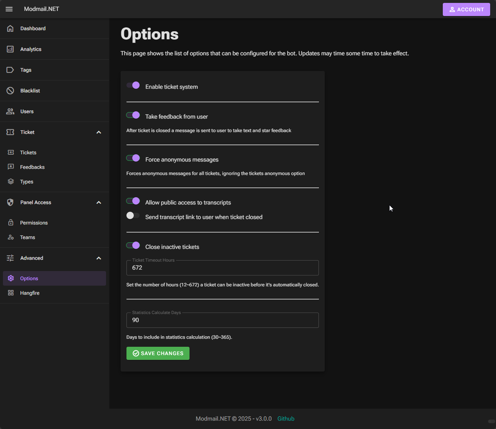

# Modmail.NET

An Open-Source feature rich Modmail Discord Bot made with .NET 

This bot can be easily setup and used on your server for managing community communication on a single way.

Bot creates tickets and users message with the bot directly instead of sending message to mods.

This bot is only available through self hosting, you can host it anywhere.

## Table of Contents

- [Modmail.NET](#modmailnet)
    - [Table of Contents](#table-of-contents)
- [Warning](#warning)
- [Features](#features)
- [Installation](#installation)
- [Multiple Servers Usage](#multiple-servers-usage)
- [Possible Upcoming Features](#possible-upcoming-features)
- [Commands](#commands)
    - [Modmail Group Slash Commands](#modmail-group-slash-commands)
        - [`/modmail setup`](#modmail-setup)
    - [Ticket Group Slash Commands](#ticket-group-slash-commands)
        - [`/ticket close`](#ticket-close)
        - [`/ticket set-priority`](#ticket-set-priority)
        - [`/ticket add-note`](#ticket-add-note)
        - [`/ticket toggle-anonymous`](#ticket-toggle-anonymous)
        - [`/ticket set-type`](#ticket-set-type)
        - [`/ticket get-type`](#ticket-get-type)
    - [Blacklist Group Slash Commands](#blacklist-group-slash-commands)
        - [`/blacklist add`](#blacklist-add)
        - [`/blacklist remove`](#blacklist-remove)
        - [`/blacklist status`](#blacklist-status)
- [Web UI](#web-ui)
- [Roadmap](#roadmap)
- [Contributing](#contributing)
- [Disclaimer](#disclaimer)

# Warning

This project may come with bugs, missing features and problems.

We are using this as our main ticket system actively however it is not fully released.

# Features

- Open tickets by sending a private message to bot
- Close tickets by using command or deleting the channel or web ui
- Logging to messages/transcript to database and modmail log channel (sensitive logging)
- Admins or mod team can respond tickets by sending message to created channel
- Toggle anonymous messages by mods, allows responding tickets anonymously
- Setting up teams adding roles and members to team for ticket management and access
- Setting priority for tickets (adds emoji to ticket channel name)
- Adding private mod notes to tickets
- Pinging team roles/members on ticket open
- Caching user information on certain guild events
- Blacklist, blocking users from opening tickets to avoid spam
- Getting feedback from user after ticket is closed. User can give up to 5 stars and reason.
- Ticket type system, users can select ticket types to select what the ticket is about.
- Moderators can talk with each other in ticket channel with by starting messages with bot prefix. To avoid message
  being sent to user.
- Web UI for configuring and seeing bot information

# Installation

1. Install .NET 8 SDK
2. Download project build and publish for your desired platform or download build from github
3. Visit Discord Developer Portal and create a new application
4. Configure appsettings.json
5. Run the app in your server

# Multiple Servers Usage

Before trying to use the bot on multiple servers you must now about the limitations;

1. This bot can only be setup once and only for main server
2. Ticket management/commands only allowed on the main server, which id provided in configuration
3. Team management/commands is locked to main server only, meaning teams and members can only be managed in main server
4. Modmail setting management/commands is locked to main server only
5. Ticket types management/commands is locked to main server only

You can simply invite bot to multiple servers and you can start using the bot

Ticket channels will created in main server

# Commands

Parameter types with '*' are required

Default prefix is '!!'

## Modmail Group Commands

Requires TeamPermissionLevel.Admin or higher

Only available for main server id in configuration

### `modmail setup`

- **Description**: Setup the modmail bot.
- **Usage**: `!!modmail setup`
- **Note**: This command should be run in the main server. Only bot owner can run this command. This command will create
  the necessary channels and roles for the modmail bot.

## Ticket Group Slash Commands

Only available in main server id set in configuration

Only available in ticket channel

This set of commands allows moderators or higher-level users to manage tickets in the Discord server.

### `/ticket close`

Requires a team member or created user if enabled in options

- **Description**: Close a ticket.
- **Parameters**:
    - `reason`: Ticket closing reason. (Optional)

### `/ticket set-priority`

Requires TeamPermissionLevel.Support or higher

- **Description**: Set the priority of a ticket.
- **Parameters**:
    - `priority`: Priority of the ticket.

### `/ticket add-note`

Requires TeamPermissionLevel.Support or higher

- **Description**: Add a note to a ticket.
- **Parameters**:
    - `note`: Note to add.

### `/ticket toggle-anonymous`

Requires TeamPermissionLevel.Moderator or higher

- **Description**: Toggle anonymous mode for a ticket.

### `/ticket set-type`

Requires TeamPermissionLevel.Support or higher

- **Description**: Set the type of a ticket.
- **Parameters**:
    - `type`: Type of the ticket.

### `/ticket get-type`

Requires TeamPermissionLevel.Support or higher

- **Description**: Gets the ticket type for the current ticket channel.
- **Usage**: `/ticket-type get`

## Blacklist Group Slash Commands

Requires TeamPermissionLevel.Moderator or higher

This set of commands allows moderators or higher-level users to manage the blacklist in the Discord server.

### `/blacklist add`

- **Description**: Add a user to the blacklist.
- **Parameters**:
    - `user`: The user to blacklist.
    - `[reason]`: The reason for blacklisting. Default is "No reason provided."
- **Usage**: `/blacklist add [user] [notify-user] [reason]`

### `/blacklist remove`

- **Description**: Remove a user from the blacklist.
- **Parameters**:
    - `user`: The user to remove from the blacklist.
- **Usage**: `/blacklist remove [user] [notify-user]`

### `/blacklist status`

- **Description**: Check if a user is blacklisted.
- **Parameters**:
    - `user`: The user to check.
- **Usage**: `/blacklist status [user]`

# Web UI

Note that these pictures can be outdated.

## Dashboard Page

## Options Page

and more...

# Roadmap
Feature roadmap, possibly upcoming features and feature ideas in no particular order

- Implement option to enable confirmation dialog when closing tickets
- Implement option to force user to select ticket type before creating the ticket
- Implement authorization permission check for all actions (Currently only implemented to blacklist option)
- Removed redundancy DI injections on classes
- Check all classes and make them sealed whenever possible 
- Implement Polly for not awaited task on bot actions for creating, add retries or add hangfire background jobs 
- Check and delete unused classes/files
- Change rules for naming enums to regular CSharp naming
- Implement SmartEnums for all enums in the project including EF Core
- Language Resources
    - Culture Resource file support for multiple languages
    - Enabling culture select and auto detect for users and admins
- API Endpoints
    - Allowing external apps to query the bot information etc.
- Encryption
    - Encrypting messages and more for security
- Editing Bot Embed Messages
    - Changing the colors and structure of embeds and bot messages
- Ticket Assign and Claim system
    - An admin can claim ticket responsibility
    - Higher role admin assing or change assignment of ticket responsibility to someone else
- Improve Ticket Type system
    - Adding automatic assignment to certain ticket types to certain teams
- Ticket Transcription
    - View and create public link of ticket messages and attachments
- Modals
    - Option to show form modals to user after ticket type selection
    - After user submits form the data should be stored to db and send to ticket channel
- Web Panel Ticket System
    - Ability to continue ticket chat through web link (for user and admin) that will require discord authentication
- Improve Attachment Handling
    - Option to Save the user attachments to server or cloud
    - This obviously requires users permissions
    - This feature might break Discord's ToS, if so can not implement this.
- Mod Stats
    - Ability to view and monitor mod activity and stats
    - New page of mod stat details, average response times, activity, resolve time, total sent messages, graphs etc.
- Change DB Provider
    - MS SQL is not the best, moving towards something like PostgresQL or adding option to configure which db to use.
- Ticket Archive
    - New filter type for tickets menu
    - Archived tickets will not be visible by default however by filtering them you will still be able to see them
    - Option to set a timeout for ticket archiving via background job. Options menu will have a TicketArchiveTimeoutDays
      value to be set for this.
- Custom reconnecting dialog
    - Default dialog is not working properly, find a way to render a custom component or a page instead of default
      dialog
- Ticket Message Edit Support
  - Allowing message editing support for users, when user edits the ticket message bot can update messages
  - Bot needs to update the message it sent to user and to mod channel. For mod channel we can also keep the old version.
  - For mod messages this is not very likely since bot deletes the mod messages sent instantly. 
  - If this option enabled bot mod message behavior needs to change
- Tag System
  - Shortcut tag messages for bot to respond with predefined messages
  - Example sending `!!tag link` message to ticket channel will take actual message from db and send detailed message
- Ticket Message Reaction Support
  - Transferring message reacting to user and from user to mod messages

# [Changelog](CHANGELOG.md)

# Contributing

Project is open to contributing if you willing to spend time fixing things or adding features. Much appreciated.

# Disclaimer

You are responsible for data safety of users and messages when you are using this bot.