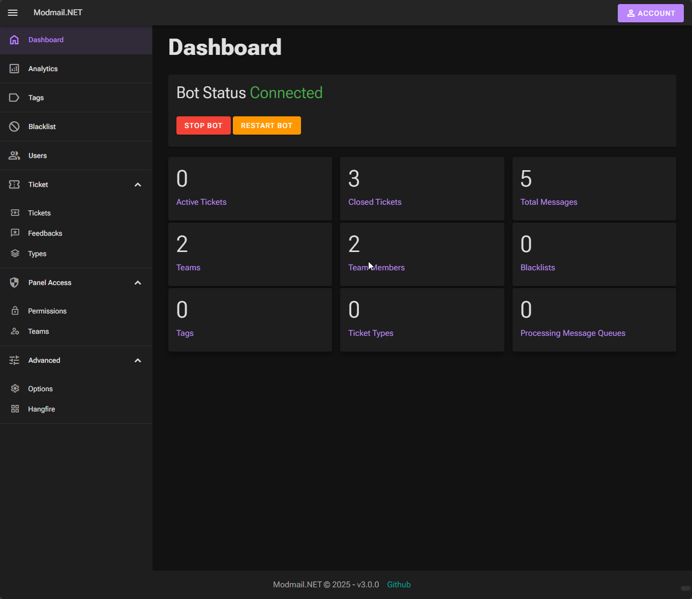

# Modmail.NET
An Open-Source Modmail Discord Bot made with .NET 8 for self hosting

This bot can be easily setup and used on your server for managing community communication on a single way.

Bot creates tickets and users message with the bot directly instead of sending message to mods.

## Table of Contents
- [Modmail.NET](#modmailnet)
  - [Table of Contents](#table-of-contents)
- [Warning](#warning)
- [Features](#features)
- [Installation](#installation)
- [Multiple Servers Usage](#multiple-servers-usage)
- [Possible Upcoming Features](#possible-upcoming-features)
- [Commands](#commands)
  - [Modmail Group Slash Commands](#modmail-group-slash-commands)
    - [`/modmail setup`](#modmail-setup)
  - [Ticket Group Slash Commands](#ticket-group-slash-commands)
    - [`/ticket close`](#ticket-close)
    - [`/ticket set-priority`](#ticket-set-priority)
    - [`/ticket add-note`](#ticket-add-note)
    - [`/ticket toggle-anonymous`](#ticket-toggle-anonymous)
    - [`/ticket set-type`](#ticket-set-type)
    - [`/ticket get-type`](#ticket-get-type)
  - [Blacklist Group Slash Commands](#blacklist-group-slash-commands)
    - [`/blacklist add`](#blacklist-add)
    - [`/blacklist remove`](#blacklist-remove)
    - [`/blacklist status`](#blacklist-status)
- [Contributing](#contributing)
- [Disclaimer](#disclaimer)

# Warning
This project is may not be ready for production needs more polishing.

If you wish to use it be aware of potential errors

# Features
- Open tickets by sending a private message to bot
- Close tickets by using command or deleting the channel or web ui
- Logging to messages/transcript to database and modmail log channel (sensitive logging)
- Admins or mod team can respond tickets by sending message to created channel
- Toggle anonymous messages by mods, allows responding tickets anonymously
- Setting up teams adding roles and members to team for ticket management and access
- Setting priority for tickets (adds emoji to ticket channel name)
- Adding private mod notes to tickets
- Pinging team roles/members on ticket open
- Caching user information on certain guild events
- Blacklist, blocking users from opening tickets to avoid spam
- Getting feedback from user after ticket is closed. User can give up to 5 stars and reason.
- Ticket type system, users can select ticket types to select what the ticket is about.
- Moderators can talk with each other in ticket channel with by starting messages with bot prefix. To avoid message being sent to user.
- Web UI for configuring and seeing bot information

# Installation
1. Install .NET 8 SDK
2. Download project build and publish for your desired platform or download build from github
3. Visit Discord Developer Portal and create a new application
4. Configure appsettings.json
5. Run the app in your server

# Multiple Servers Usage
Before trying to use the bot on multiple servers you must now about the limitations;

1. This bot can only be setup once and only for main server
2. Ticket management/commands only allowed on the main server, which id provided in configuration
3. Team management/commands is locked to main server only, meaning teams and members can only be managed in main server
4. Modmail setting management/commands is locked to main server only
5. Ticket types management/commands is locked to main server only

You can simply invite bot to multiple servers and you can start using the bot

Ticket channels will created in main server

# Commands
Parameter types with '*' are required

Default prefix is '!!'

## Modmail Group Commands 
Requires TeamPermissionLevel.Admin or higher

Only available for main server id in configuration
### `modmail setup`
- **Description**: Setup the modmail bot. 
- **Usage**: `!!modmail setup`
- **Note**: This command should be run in the main server. Only bot owner can run this command. This command will create the necessary channels and roles for the modmail bot.

## Ticket Group Slash Commands 
Requires TeamPermissionLevel.Moderator or higher

Only available in main server id set in configuration

Only available in ticket channel

This set of commands allows moderators or higher-level users to manage tickets in the Discord server.

### `/ticket close`

- **Description**: Close a ticket.
- **Parameters**:
  - `reason`: Ticket closing reason. (Optional)

### `/ticket set-priority`

- **Description**: Set the priority of a ticket.
- **Parameters**:
  - `priority`: Priority of the ticket.

### `/ticket add-note`

- **Description**: Add a note to a ticket.
- **Parameters**:
  - `note`: Note to add.

### `/ticket toggle-anonymous`

- **Description**: Toggle anonymous mode for a ticket.

### `/ticket set-type`

- **Description**: Set the type of a ticket.
- **Parameters**:
  - `type`: Type of the ticket.

### `/ticket get-type`

- **Description**: Gets the ticket type for the current ticket channel.
- **Usage**: `/ticket-type get`

## Blacklist Group Slash Commands
Requires TeamPermissionLevel.Moderator or higher

This set of commands allows moderators or higher-level users to manage the blacklist in the Discord server.

### `/blacklist add`

- **Description**: Add a user to the blacklist.
- **Parameters**:
    - `user`: The user to blacklist.
    - `[reason]`: The reason for blacklisting. Default is "No reason provided."
- **Usage**: `/blacklist add [user] [notify-user] [reason]`

### `/blacklist remove`

- **Description**: Remove a user from the blacklist.
- **Parameters**:
    - `user`: The user to remove from the blacklist.
- **Usage**: `/blacklist remove [user] [notify-user]`

### `/blacklist status`

- **Description**: Check if a user is blacklisted.
- **Parameters**:
    - `user`: The user to check.
- **Usage**: `/blacklist status [user]`

# Web UI

## Dashboard Page

## Options Page

and more...

# Possible Features and TODOs
- A public and private authenticated API
- Encrypt message information and other sensitive information
- Ability to enable confirmation dialog when closing tickets
- Ability to change Anonymous messaging on GuildOption to allow default behavior
- Language file support for multiple languages, getting or asking user about language they want to interact with
- Editing embeds and colors and language file via Web UI
- Improve ticket type system, assign tickets to teams automatically
- Ability to search through ticket messages
- Ability to create public transcripts link that can be shared with user
- Ability to show modals when user has selected ticket type and configurable through web ui
- Internal or External authentication and role system for web ui. As well as ability to assign teams to access to web ui via discord auth.
- Ability to continue ticket chat through web link (for user and admin) that will require discord authentication
- Improve and/or add filters to web ui pages
- Write tests
- Ability to disable admin commands for bot. (This can be done since web ui is implemented)
- Check and show message when an invalid emoji is provided to Ticket Type or convert it to a emoji selector
- Check attachment handling methods and let bot create a preview of images instead of connecting links

# Contributing
Create a pull request by using semantic commits and proper explanation

# Disclaimer
You are responsible for data safety of users and messages when you are using this bot.